# BalearTrek - Aplicación de Trekking en las Islas Baleares

BalearTrek es una aplicación web completa para descubrir, reservar y participar en trekking y excursiones en las islas Baleares. La plataforma permite a los usuarios explorar diferentes treks, unirse a meetings (encuentros de senderismo), dejar comentarios y reseñas, mientras que los guías pueden gestionar sus propias rutas y ver quién está inscrito.

## 📋 Tabla de Contenidos

- [Características](#características)
- [Requisitos](#requisitos)
- [Instalación](#instalación)
- [Estructura del Proyecto](#estructura-del-proyecto)
- [Configuración](#configuración)
- [API Endpoints](#api-endpoints)
- [Modelos de Datos](#modelos-de-datos)
- [Autenticación](#autenticación)
- [Funcionalidades](#funcionalidades)

## ✨ Características

### Para Visitantes

- 🗺️ Explorar treks disponibles con filtros por isla
- 🔍 Ver detalles de treks (descripción, lugares interesantes, meetings)
- 📝 Dejar comentarios y puntuaciones en treks
- 👥 Inscribirse a meetings (encuentros de senderismo)
- 👤 Gestionar perfil personal
- 📊 Ver historial de meetings inscritos
- 💬 Ver comentarios publicados

### Para Guías

- 🚀 Crear y gestionar sus propios meetings
- 👥 Ver lista de usuarios inscritos en sus meetings
- 📈 Gestionar perfil como guía
- ⭐ Recibir comentarios y puntuaciones de usuarios

### Generales

- 🔐 Autenticación segura con tokens Sanctum
- 📱 Diseño responsive y adaptable
- 🎨 Interfaz moderna con tema personalizado
- 📧 Formulario de contacto
- 🚫 Opción de desactivar cuenta

## 📦 Requisitos

### Backend

- PHP >= 8.1
- Laravel 11
- MySQL/MariaDB
- Composer

### Frontend

- Node.js >= 16
- npm o yarn
- Vite

## 🚀 Instalación Rápida

### Backend

```bash
cd backend
composer install
cp .env.example .env
php artisan key:generate
php artisan migrate
php artisan db:seed
php artisan serve
```

### Frontend

```bash
cd frontend
npm install
npm run dev
```

## 🏗️ Estructura del Proyecto

### Backend (Laravel)

- Controllers: API RESTful con endpoints
- Models: User, Trek, Meeting, Comment, Role, Island, Zone, etc.
- Migrations: Estructura de base de datos
- Seeders: Datos iniciales
- Resources: API formatters para respuestas JSON

### Frontend (React + Vite)

- Components: Landing, Trek Details, Profile, Login, Register, Contact
- API: Axios client con interceptores
- Router: React Router v6 para navegación
- Styles: CSS custom con variables de tema

## ⚙️ Variables de Entorno

```env
# Backend .env
DB_CONNECTION=mysql
DB_HOST=127.0.0.1
DB_DATABASE=balear_trek
DB_USERNAME=root
SANCTUM_STATEFUL_DOMAINS=localhost:5173

# Frontend .env
VITE_API_URL=http://localhost:8000
```

## 🔌 API Endpoints Principales

| Método | Endpoint                 | Descripción       |
| ------ | ------------------------ | ----------------- |
| POST   | `/api/register`          | Registrar usuario |
| POST   | `/api/login`             | Iniciar sesión    |
| GET    | `/api/user`              | Obtener perfil    |
| PUT    | `/api/user/deactivate`   | Desactivar cuenta |
| GET    | `/api/treks`             | Listar treks      |
| GET    | `/api/treks/{id}`        | Detalles de trek  |
| GET    | `/api/treks/illa/{isla}` | Filtrar por isla  |

## 💾 Modelos Principales

### User

- name, lastName, email, password, dni, phone
- role_id (visitant/guia/admin)
- status (s=activo, n=inactivo)
- Relaciones: meetings (inscritos), meeting (como guía), comments

### Trek

- name, description, difficulty, duration, distance
- island_id
- Relaciones: meetings, comments, places (interesantes)

### Meeting

- trek_id, user_id (guía), day, hour, max_participants
- Relaciones: users (participantes)

### Comment

- user_id, trek_id, comment, score (1-5)

### Role

- name: visitant, guia, admin

## 🔐 Autenticación

- Sanctum tokens almacenados en localStorage
- Interceptor automático en requests
- Rutas protegidas con ProtectedRoute
- Token enviado en header Authorization: Bearer {token}

## 🎯 Funcionalidades Principales

### Landing Page

- Grid de treks con tarjetas
- Filtrados por isla
- Búsqueda

### Trek Details

- Información completa
- Lugares de interés
- Meetings disponibles
- Comentarios con puntuación
- Crear comentario (autenticado)

### Perfil Usuario

- Info personal
- Rol visible
- Meetings inscritos
- Meetings como guía (con inscritos)
- Comentarios publicados (si activo)
- Botón desactivar cuenta

### Página de Contacto

- Formulario: nombre, email, asunto, mensaje
- Validación completa
- Mensajes éxito/error

## 🎨 Diseño

Paleta de colores:

- Primario: #1b7f7a (Turquesa)
- Secundario: #2a8f88
- Acento: #f1b85b
- Rojo (botones críticos): #dc3545

Tipografía:

- Fraunces: Headings
- Space Grotesk: Body

## 🚀 Ejecución

### Desarrollo (dos terminales)

```bash
# Terminal 1
cd backend && php artisan serve

# Terminal 2
cd frontend && npm run dev
```

Acceder a: http://localhost:5173

### Producción

```bash
cd frontend && npm run build
# Servir carpeta dist/
```

## 🔒 Seguridad

- Passwords hasheadas (bcrypt)
- CORS configurado
- Validación en cliente y servidor
- Tokens Sanctum
- Rutas protegidas por middleware

## 📝 Stack Tecnológico

**Backend:**

- Laravel 11
- Laravel Sanctum
- MySQL
- PHP 8.1+

**Frontend:**

- React 18
- Vite
- React Router v6
- Axios
- CSS3

## 🐛 Troubleshooting

| Problema                | Solución                                           |
| ----------------------- | -------------------------------------------------- |
| Error 401               | Verificar token en localStorage / Re-login         |
| CORS Error              | Revisar config/cors.php y SANCTUM_STATEFUL_DOMAINS |
| Comentarios no aparecen | Verificar user.status !== 'n'                      |
| Token no persiste       | Verificar localStorage habilitado / Revisar api.js |

### Error 401:

El frontend no guardaba ni enviaba token. Guardamos el token en localStorage. Con axios ponemos el token en el header en todas las peticiones.

En el backend faltaba configuar el auth.php para que tambien use el sanctum, 


## 📚 Documentación

- [Laravel](https://laravel.com)
- [React](https://react.dev)
- [Vite](https://vitejs.dev)
- [Sanctum](https://laravel.com/docs/sanctum)

---

## Pruebas

### BackEnd

- Usuario
  - Clickamos en Usuario nuevo, y rellenamos los campos
    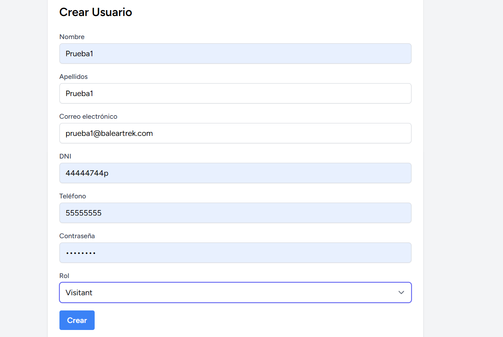
    Confirmamos que se ha creado
    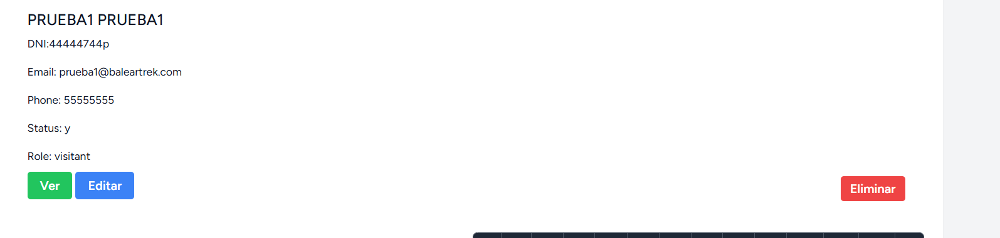
    Confirmamos que el editar funciona
    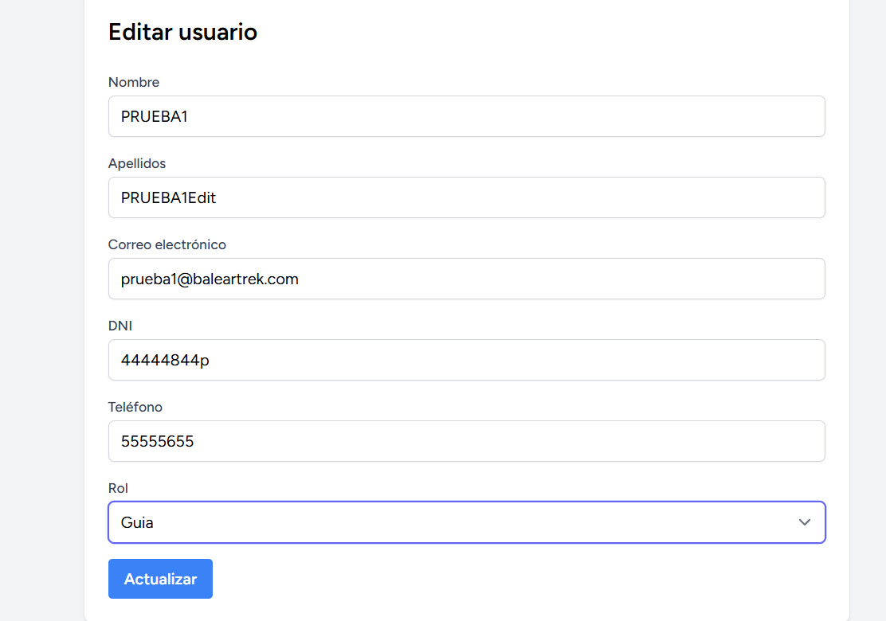
    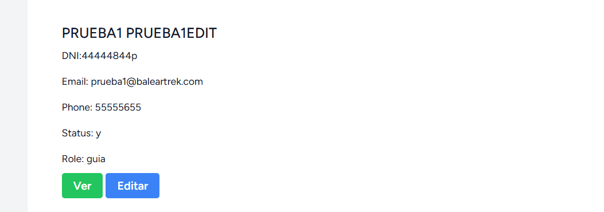
    Al eliminar vemos que cambia el estado a N
    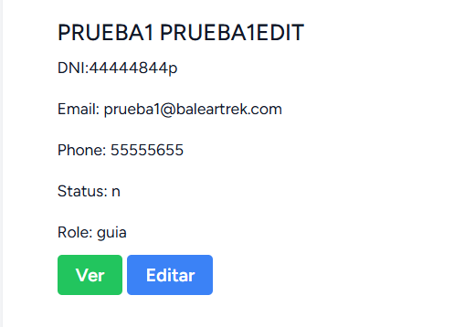

- Municipio
  - Clickamos en Municipio nuevo, y rellenamos los campos
    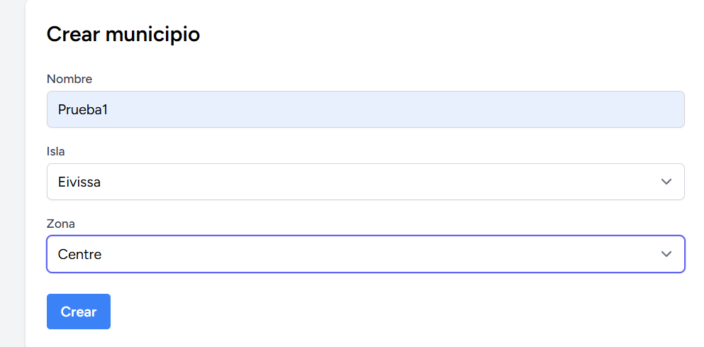
    Confirmamos que se ha creado
    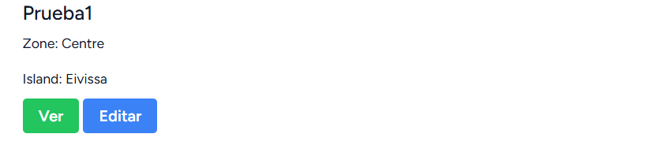
    Confirmamos que el editar funciona
    
    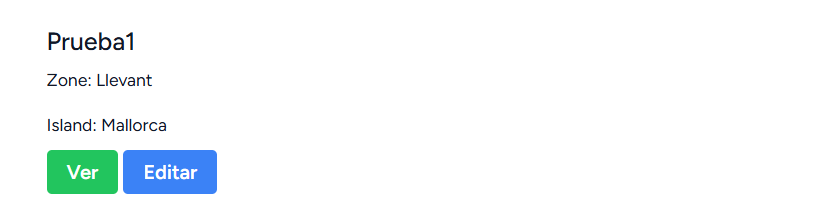
    Confirmamos que el elimanar funciona
    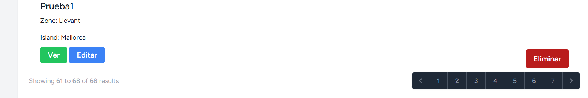
    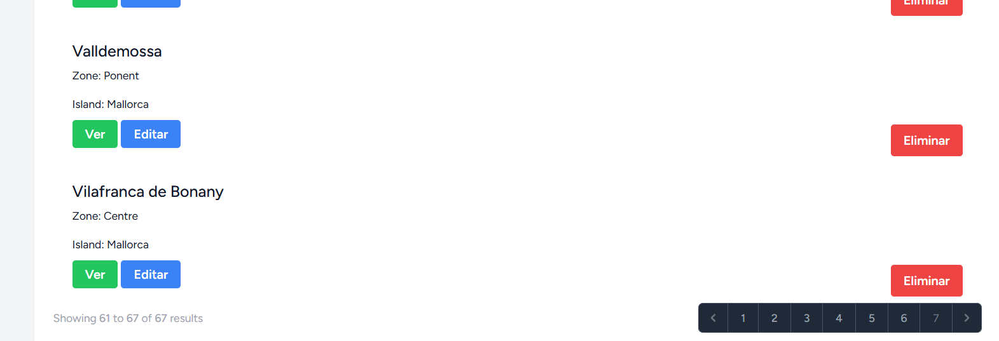(vemos que hay uno menos)

- Treks
  - Clickamos en Trek nuevo, y rellenamos los campos
    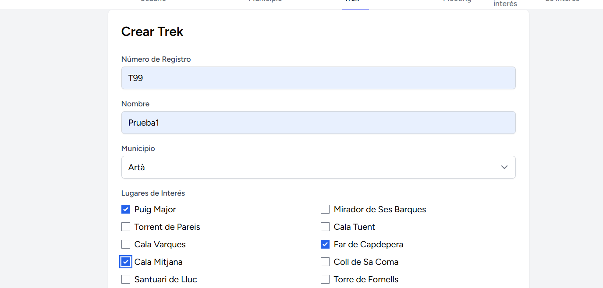
    Confirmamos que se ha creado
    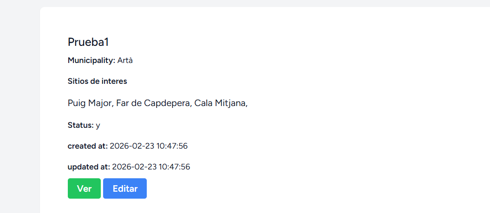
    Confirmamos que el editar funciona
    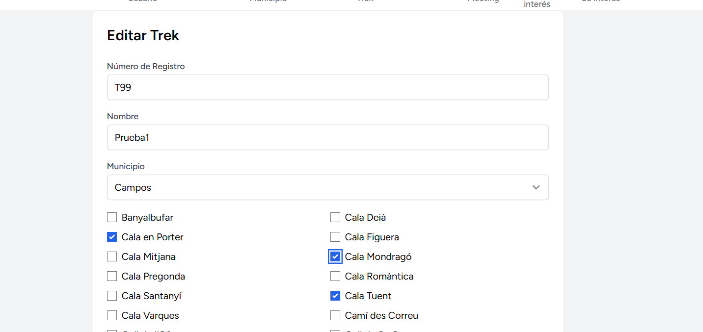
    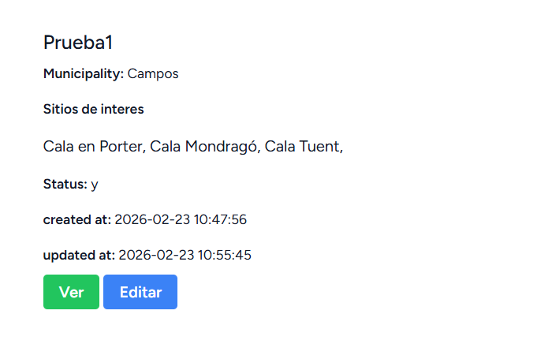
    Confirmamos que el eliminar funciona
    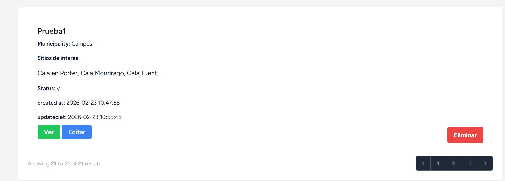
    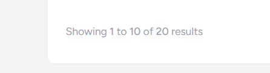(vemos que hay uno menos)

- Meeting
  - Clickamos en Meeting nuevo, y rellenamos los campos
    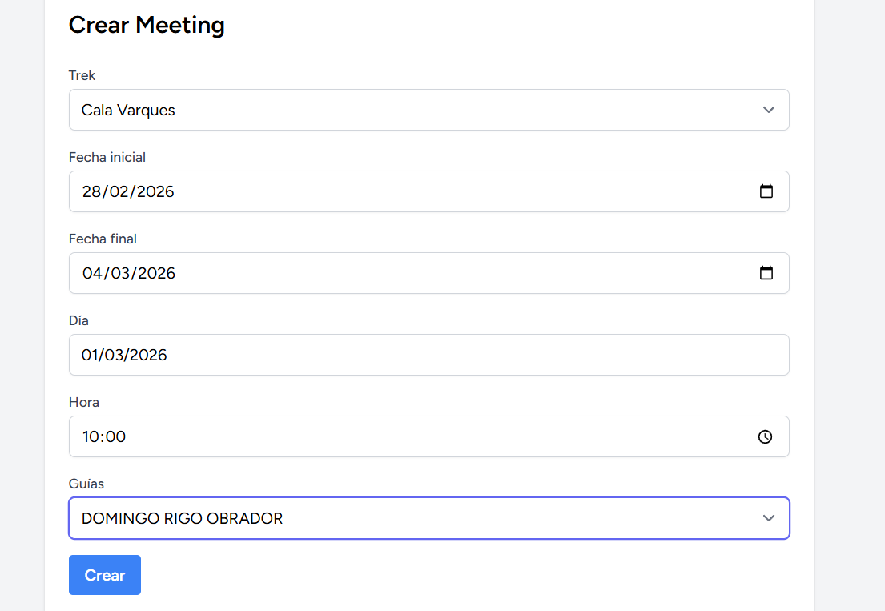
    Confirmamos que se ha creado
    
    Confirmamos que el editar funciona
    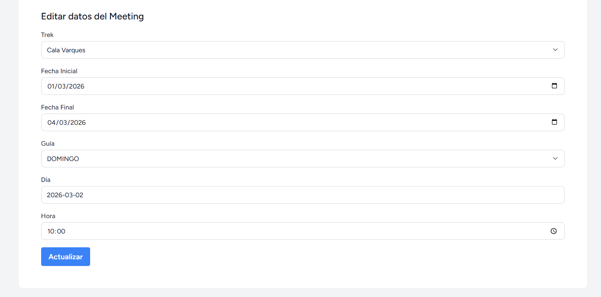
    
    Confirmamos que el eliminar funciona
    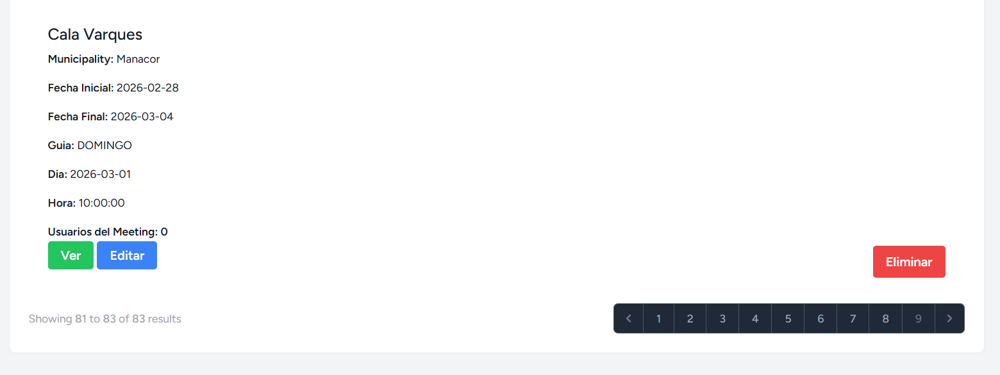
    (vemos que hay uno menos)
- Lugares de Interes
  - Clickamos en Lugar de interes nuevo, y rellenamos los campos
    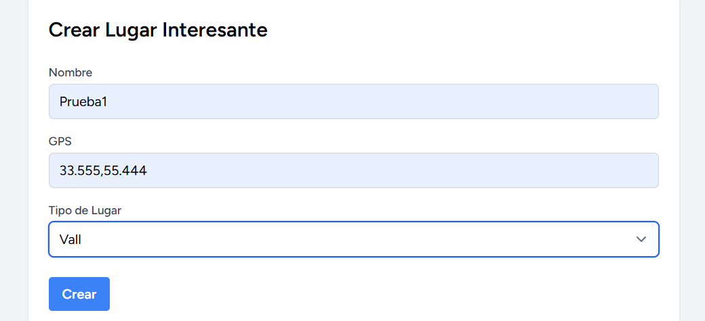
    Confirmamos que se ha creado
    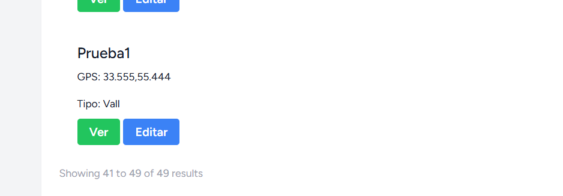
    Confirmamos que el editar funciona
    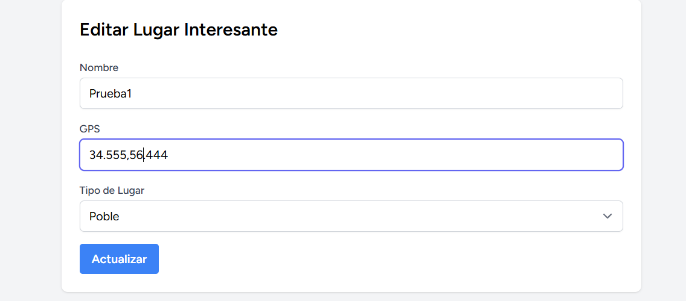
    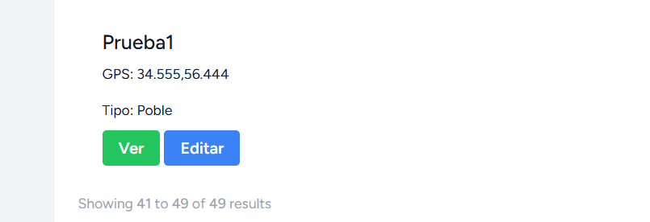
    Confirmamos que el eliminar funciona
    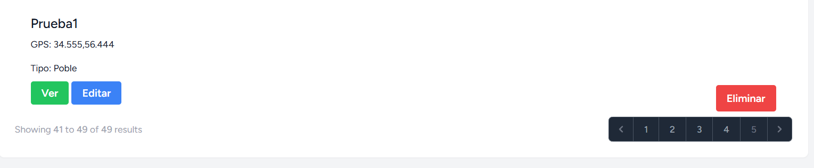
    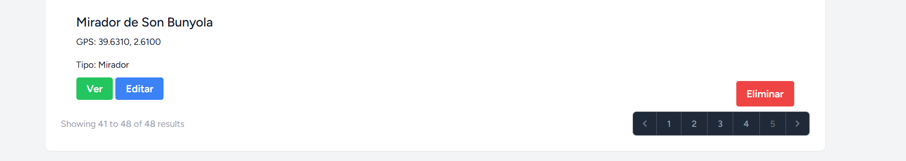(vemos que hay uno menos)

**Última actualización:** Febrero 2026

Para más información contacta a través del formulario de contacto de la aplicación.
